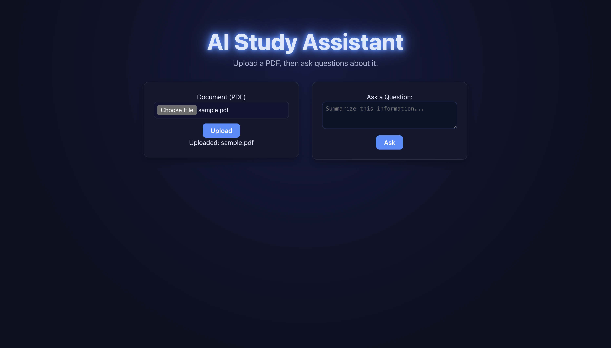

# AI Study Assistant

A full-stack application that lets you **upload PDF documents** and **ask questions** about its content using OpenAI’s GPT and embeddings models.

Built with **Java Spring Boot**, **React**, and **PostgreSQL**.

---

## Features
- Upload and automatically process PDF documents.
- Extract text using Apache PDFBox and chunk it for semantic search.
- Generate OpenAI embeddings and store them in PostgreSQL.
- Ask natural language questions with cited sources.
- Clean React interface with real-time AI responses.

---

## Tech Stack
| Layer | Technology |
|-------|-------------|
| Frontend | React, Axios, React Markdown |
| Backend | Java, Spring Boot, Hibernate, OkHttp |
| Database | PostgreSQL |
| AI | OpenAI Embeddings + GPT-4-mini |
| Tools | Maven, npm, REST API |

---

## Setup

### Backend
- Make sure you have **Java 17+** and **PostgreSQL** installed.
- This uses the OpenAI API for embeddings and chat completions.  
  You’ll need your own API key to run it.
  
    1. Get a key from [https://platform.openai.com/account/api-keys](https://platform.openai.com/account/api-keys)
    2. Export it before running the backend:
       ```bash
       export OPENAI_API_KEY="sk-proj-..."
- The backend reads it via application.properties:
  ```bash
  openai.api.key=${OPENAI_API_KEY}

- Run:
  ```bash
  cd backend
  mvn spring-boot:run
### Frontend
- In a new terminal:
  ```bash
  cd frontend
  npm install
  npm run dev
- Visit "http://localhost:5173/"

## Example Screenshots

### Home Page


### Upload Example


### AI Answer Example


